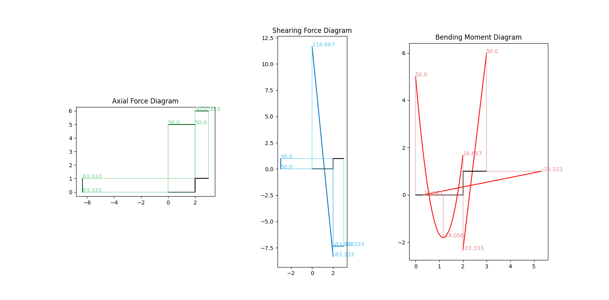

# matrixDisplacementMethod

**——基于矩阵位移法的二维结构内力图绘制器**

[](https://github.com/IceTiki/matrixDisplacementMethod)



### 功能

- [ ] matplotlib绘图
  - [x] 轴力
  - [x] 剪力
  - [x] 弯矩
  - [ ] 绘制荷载和约束
- [x] 结构定义
  - [x] 自由定义节点位置
  - [x] 自由定义构件的EA和EI
  - [x] 自由定义节点约束条件
  - [x] 自由定义节点与构件的间约束条件

    > 假设两端钢结点的情况写出等效节点荷载
    >
    > 再设置节点约束，求解矩阵，得到真正的等效节点荷载
  
- [x] 荷载定义
  - [x] 节点上的集中荷载
  - [x] 在构件上布置均布荷载
    - [x] 构件法向均布荷载
    - [x] 构件轴向均布荷载
  - [ ] 在单元上任意布置荷载
    - [ ] 函数曲线荷载
    - [ ] 集中荷载列表


### 特性

* 坐标系是数学上常用的右手坐标系（结构力学书上常用左手坐标系）
  * 力在x, y轴正方向为正
  * 力矩逆时针方向为正

### 问题

* 内力图的正负在特殊情况可能相反

## 教程

### 示例

1. 定义**节点**(输入<u>坐标, 约束条件, 荷载......</u>)
2. 定义**构件**(输入<u>两个节点组成一个构件</u>)
3. 定义**结构**(输入<u>一个节点</u>，自动寻找所有与之相关的节点和构件)
4. **计算**和**绘图**

```python
from matrixDisplacementMethod import Node, Element, Struction

n1 = Node(position=(0, 0), constraints=(1, 1, 1))
n2 = Node(position=(2, 0))
n3 = Node(position=(2, 1), load=(0, 0, 10))
n4 = Node(position=(3, 1), constraints=(1, 1, 1))
e1 = Element(node=(n1, n2), q=(0, -100))
e2 = Element(node=(n2, n3))
e3 = Element(node=(n3, n4))
c1 = Struction(firstNode=n1)
c1.printImage(outputType=1)
```

## 参考

* [第9章-弯矩分配法 - 豆丁网](https://www.docin.com/p-2175792518.html)

  > 原本想写弯矩分配法，但没成功
  
* [Python与Ansys apdl有限元系列二：矩阵位移法计算桁架结构_王.伟的博客-CSDN博客](https://blog.csdn.net/weixin_43717845/article/details/105515372)

  > 大概看了一眼，知道实现矩阵位移法的代码量不大

* [01 -- 矩阵位移法 - 知乎](https://zhuanlan.zhihu.com/p/57871511)

  > 这篇很有用，特别是关于边界条件的处理
  
* [结构力学.NET](http://www.jglx.net/)

  > 一个基于矩阵位移法的结构力学计算器，我编写的过程中，数据就是与这个计算器做对比。
  > 因为这个结构力学计算器不支持更改EI和EA，而且节点不能精确定义节点位置，所以我自己写了一个。

