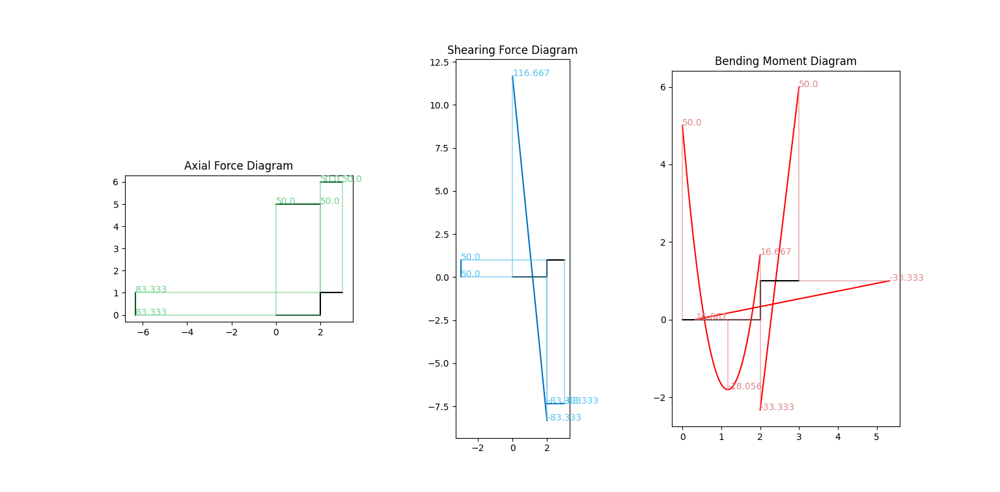

# matrixDisplacementMethod

**——基于矩阵位移法的二维结构内力图绘制器**



---

## 简介

基于矩阵位移法的**平面结构力学求解器**（借助`numpy`和`matplotlib`模块辅助计算和绘图）。

只需要使用`节点Node`、`构件Element`、`结构Struction`三个类即可快速组建结构。

在初始化对象时输入结构的相关参数（位置、约束条件、荷载等），即可快速求解并绘图。

## 详细文档
* [使用文档](docs/使用文档.md)
* [开发手册](docs/开发手册.md)

## 快速开始

> 1. 新建文件夹
> 2. 将代码文件夹`matrixDisplacementMethod`（注意，不要在解压时套了两层文件夹）移动到新建的文件夹内
> 3. 创建一个`*.py`文件，输入以下示例代码。并运行。

1. 定义**节点**(输入<u>坐标, 约束条件, 荷载......</u>)
2. 定义**构件**(输入<u>两个节点组成一个构件</u>)
3. 定义**结构**(输入<u>一个节点</u>，自动寻找所有与之相连的节点和构件)
4. **计算**和**绘图**

```python
from matrixDisplacementMethod import Node, Element, Struction

# 定义节点Node
n1 = Node(position=(0, 0), constraints=(1, 1, 1)) # 定义节点位置、约束情况(x,y,转角)、荷载(见n3节点)
n2 = Node(position=(2, 0))
n3 = Node(position=(2, 1), load=(0, 0, 10))
n4 = Node(position=(3, 1), constraints=(1, 1, 1))
# 定义构件Element
e1 = Element(node=(n1, n2), q=(0, -100)) # 定义杆件由哪两个节点相连、均布荷载的方向与大小(皆使用笛卡尔坐标系)
e2 = Element(node=(n2, n3))
e3 = Element(node=(n3, n4))
# 定义结构Struction
c1 = Struction(first_node=n1) # 选择结构内的一个节点(通过广度优先搜索, 寻找所有相连节点, 建立整个结构)
c1.print_image(output_type=1) # 绘制内力图(多种输出方式)
```

> **注意事项**
>
> 坐标系是数学上常用的右手坐标系（结构力学书上常用左手坐标系）
>
> * 力在x, y轴正方向为正
> * 力矩逆时针方向为正
>
> 各种物理量没有单位，建议所有物理量的单位统一使用`m`、`s`、`kg`以及其导出单位。

## 链接

[](https://github.com/IceTiki)[](https://github.com/IceTiki/matrixDisplacementMethod)
